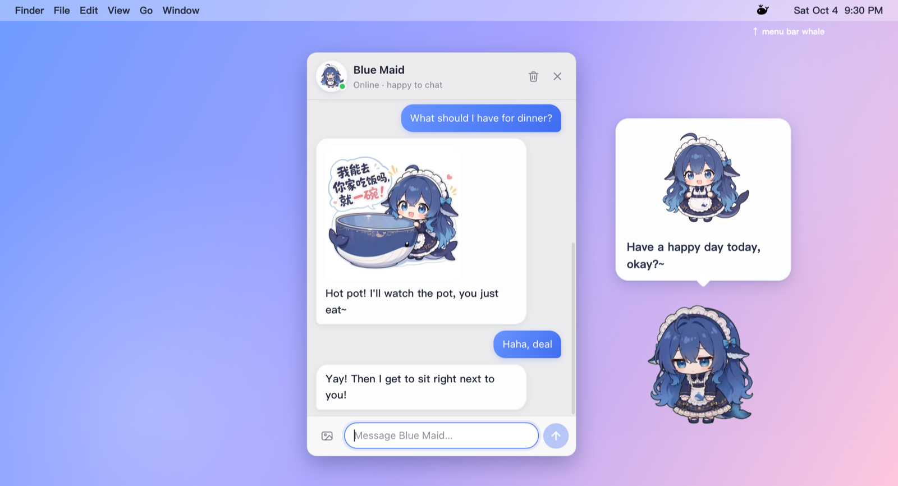
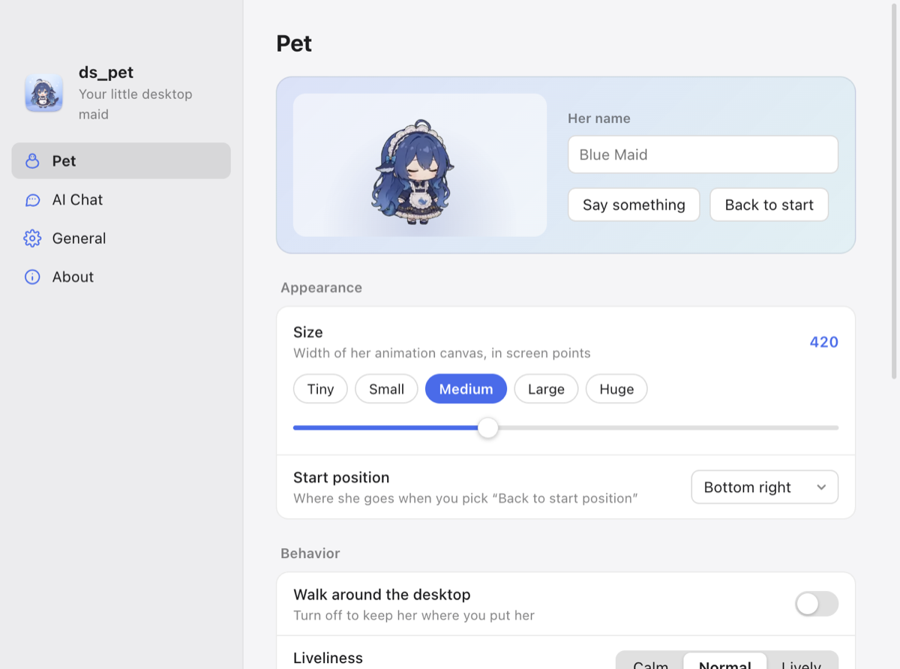

<p align="center">
  
</p>

<h1 align="center">ds_pet</h1>

<p align="center">
  A blue-haired maid who lives on your macOS desktop. Drag her, fling her, let her chatter —<br>
  or chat with her and show her your pictures.<br>
  <a href="README.md">简体中文</a> · <b>English</b>
</p>

<p align="center">
  <a href="https://github.com/cjian1/ds_pet/releases/latest"><b>⬇︎ Download the latest release</b></a>
</p>

> [!NOTE]
> **ds_pet is a remix of [PC2005-cloud/dsh-pet](https://github.com/PC2005-cloud/dsh-pet).**
> The pet character, animations, artwork, physics and gameplay all come from the original project (MIT license). ds_pet turns it into a standalone macOS app and adds a chat panel, a settings window and a bilingual interface. Many thanks to the original author! See [NOTICE.md](NOTICE.md) for details.

<p align="center">
  
</p>

## Install (3 steps)

**1. Download** the right file from [Releases](https://github.com/cjian1/ds_pet/releases/latest):

| Your Mac | Download |
|---|---|
| Apple silicon (M1 / M2 / M3 / M4…, most Macs from late 2020 on) | `ds_pet-<version>-arm64.dmg` |
| Intel | `ds_pet-<version>-x64.dmg` |

> Not sure which one you have? Click  → About This Mac and look at "Chip". Requires macOS 12 or later.

**2. Install**: open the `.dmg` and drag ds_pet into the Applications folder.

**3. First launch**: double-click ds_pet in Applications. The app isn't signed with a paid Apple developer ID, so macOS stops it the first time. Allow it once:

- If it says the developer can't be verified: click "Done", open **System Settings › Privacy & Security**, scroll down, click **Open Anyway**, then open ds_pet again.
- If it says the app is "damaged": open Terminal, paste this line, press Return, then open ds_pet again:

  ```bash
  xattr -dr com.apple.quarantine /Applications/ds_pet.app
  ```

She'll appear in the bottom-right corner of your desktop, and a little 🐳 whale shows up in the menu bar.

### Want to chat? Pick an AI provider

The first time you open the app, Settings opens for you. Under **AI Chat**, pick a provider, paste its API key and click **Save** (it tests the key first and picks a model for you). The default is [DeepSeek](https://platform.deepseek.com/api_keys).

| Provider | Notes |
|---|---|
| **DeepSeek** (default) | Image input, thinking level, balance reports |
| OpenAI | Thinking level |
| Claude (Anthropic) | Uses Anthropic's own API |
| Google Gemini | Thinking level |
| Moonshot Kimi · Zhipu GLM · Qwen · SiliconFlow · OpenRouter | Just add a key |
| Doubao (Volcengine Ark) | Put your endpoint ID or model name in the model field |
| Ollama (local models) | No key needed; nothing leaves your Mac |
| Custom endpoint | Any OpenAI-compatible or Anthropic-compatible API (LM Studio, relay services, …) |

Each provider keeps its own key, base URL and model, so switching back and forth loses nothing. To go through a proxy or relay, just change the base URL.

No key? You can still drag her, fling her, poke her and play 100+ animations — none of that needs the internet.

The interface follows your system language. To switch, go to Settings → General → Language. In English mode she talks to you in English too.

## How to play

| Action | What happens |
|---|---|
| Hold and drag her | Move her anywhere, even to another display. She **remembers where you leave her** |
| Flick while dragging | She flies off, bounces off the screen edges and lands with a squish |
| Click | Pat her head — she reacts |
| **Right-click** | Chat, say something, show her a picture, check balance, play animations, resize, hide, settings, quit |
| Drop a picture on her | She tells you what it is, then asks what you'd like her to do |
| Menu bar 🐳 icon | Show/hide, chat, size, random chatter, open at login, settings, quit |
| **⌃⌥P** | Show/hide her from any app (handy for meetings and screen sharing; change it in Settings) |

Clicking or dragging her won't pull focus from the app you're using. Clicks on the transparent area around her go straight through to the windows below.

**The chat panel** sits right next to her. Replies stream in word by word, often with a sticker. Press Enter to send and Shift+Enter for a new line. You can paste a screenshot with ⌘V to show her, and Esc closes the panel.

## Settings

Right-click her → **Settings…**, or click the menu bar whale → **Settings…**. Changes apply **immediately**.

<p align="center"></p>

- **Pet**: name, size, start position, walking around, liveliness, fling strength, random chatter (frequency and stickers), balance reports
- **AI Chat**: provider, API key, base URL, model (pick from the list or type one), thinking level, how many messages she remembers, clear chat history, personality
- **General**: language (match system / 简体中文 / English), open at login, Dock icon, show over full-screen apps, show/hide shortcut

## FAQ

<details>
<summary><b>She's in the way of things I want to click.</b></summary>

Only her body catches clicks; the transparent area around her passes clicks through. If she's still in the way, right-click → <b>Size</b> to make her smaller, or press <b>⌃⌥P</b> to hide her (press again to bring her back).
</details>

<details>
<summary><b>Is my API key safe? Will this cost a lot?</b></summary>

The key is stored only on your Mac (<code>~/Library/Application Support/ds_pet/settings.json</code>, readable only by your user account) and is only ever sent to the provider you chose. The app has no analytics or telemetry.<br>
Random chatter happens once every 15 minutes by default, and stops while you're away from your computer for more than 10 minutes. To use less credit, lower the frequency or turn chatter off in Settings.
</details>

<details>
<summary><b>She talks too much / too little.</b></summary>

Settings → Pet → <b>Chatter frequency</b> and <b>Liveliness</b>.
</details>

<details>
<summary><b>How do I quit or uninstall?</b></summary>

Quit: right-click her → <b>Quit ds_pet</b>, or menu bar whale → <b>Quit</b>.<br>
Uninstall: turn off <b>Open at login</b> in Settings → General, quit, then move ds_pet from Applications to the Trash. To remove your data too, delete <code>~/Library/Application Support/ds_pet</code>.
</details>

<details>
<summary><b>Can I replace her animations?</b></summary>

Put a <code>.webm</code> with the same file name into <code>~/Library/Application Support/ds_pet/animations/</code> and it will be used instead (see <code>desktop/assets/webm/</code> for the names).
</details>

<details>
<summary><b>Why are the stickers in Chinese?</b></summary>

The stickers come from the original artwork of dsh-pet. Her words follow your language setting, but the text drawn inside the sticker images stays as it is.
</details>

<details>
<summary><b>Does it run on Windows?</b></summary>

Not yet. ds_pet needs macOS 12 or later. On Windows, have a look at the original project <a href="https://github.com/PC2005-cloud/dsh-pet">dsh-pet</a>, which is a plugin for DSH.
</details>

## Run from source

Requires [Node.js](https://nodejs.org/) 20 or later.

```bash
git clone https://github.com/cjian1/ds_pet.git
cd ds_pet
npm install
npm start
```

The first `npm start` downloads Electron automatically (about 100 MB).

Build installers:

```bash
npm run dist          # this Mac's architecture → dist/ds_pet-<version>-<arch>.dmg
npm run dist:all      # both Apple silicon and Intel
npm run install-app   # build and install straight into Applications
```

Builds only use tools that ship with macOS (`ditto` / `codesign` / `hdiutil`); no Apple developer account needed.

<details>
<summary>Project layout</summary>

```
desktop/                 The app itself (copied into the .app as is)
  main/                  Main process: menu bar, windows, shortcut, login item, AI calls (providers.js lists the providers), storage
  pet/                   Pet page: animations, drag & fling physics, speech bubbles (from dsh-pet)
  chat/                  Chat panel
  settings/              Settings window
  i18n/                  Chinese and English strings
  assets/                106 animations, stickers, font, default config (from dsh-pet)
  resources/             App icon, menu bar icon
scripts/
  build-mac.sh           Build script (--dmg / --arch arm64|x64 / --install)
  make-icons.js          Regenerate icons (npm run icons)
  dmg-readme.txt         Read-me included in the disk image
  debug/                 Small debugging tools (inspect pages, screenshots, simulated drags)
.github/workflows/       Builds and publishes to Releases when a version tag is pushed
```

`npm run dev` starts with debugging ports open: main process on 9334, pages on 9333. When you add interface text, put both the Chinese and English versions into `desktop/i18n/i18n.js`.
</details>

### Releasing a new version

1. Bump `version` in `desktop/package.json` (for example `1.0.1`).
2. Commit, then tag and push: `git tag v1.0.1 && git push origin main v1.0.1`.
3. GitHub Actions builds the Apple silicon and Intel versions and publishes them to Releases.

## Credits & license

- **Original project**: [PC2005-cloud/dsh-pet](https://github.com/PC2005-cloud/dsh-pet) (MIT). The pet character, animations, artwork, physics and gameplay come from the original project, and the character and artwork copyright belongs to the original authors. The original license is kept in [`desktop/LICENSE.dsh-pet`](desktop/LICENSE.dsh-pet); see [NOTICE.md](NOTICE.md) for details.
- **This project's** code is released under the [MIT](LICENSE) license.
- Chat is powered by the AI provider you choose ([DeepSeek](https://platform.deepseek.com/) by default). This is a personal project and is not affiliated with any provider.
