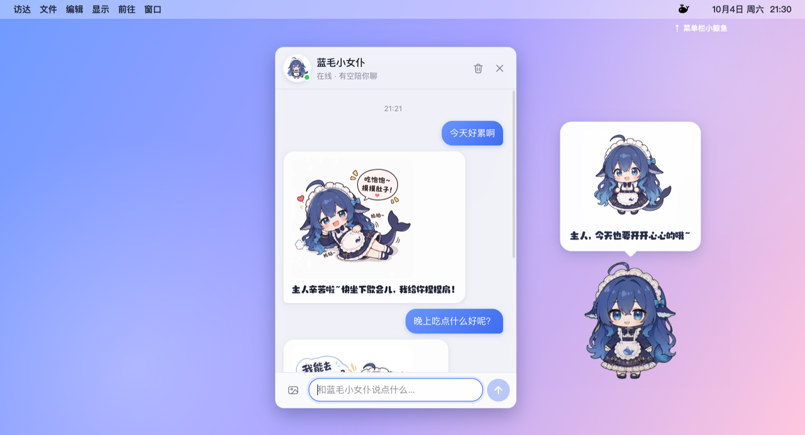
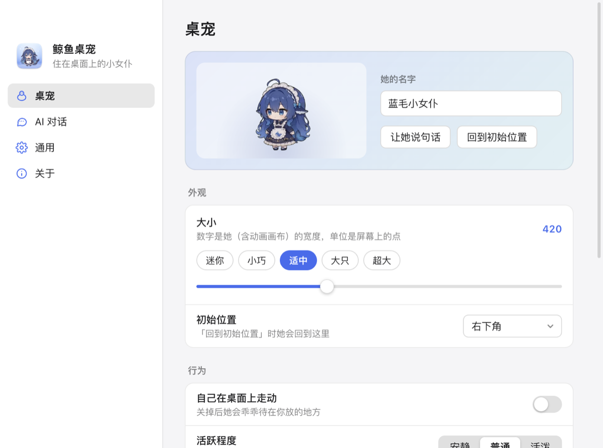

<p align="center">
  
</p>

<h1 align="center">ds_pet</h1>

<p align="center">
  住在 macOS 桌面上的蓝毛小女仆：能拖、能甩、会碎碎念，还能陪你聊天、帮你看图。<br>
  <b>简体中文</b> · <a href="README.en.md">English</a>
</p>

<p align="center">
  <a href="https://github.com/cjian1/ds_pet/releases/latest"><b>⬇︎ 下载最新版</b></a>
</p>

> [!NOTE]
> **ds_pet 基于 [PC2005-cloud/dsh-pet](https://github.com/PC2005-cloud/dsh-pet) 二次创作。**
> 桌宠角色、动画、美术、物理与玩法均来自原项目（MIT 协议）；ds_pet 把它做成了独立的 macOS 应用，并加入了聊天面板、设置界面和中英双语。感谢原作者！详见 [NOTICE.md](NOTICE.md)。

<p align="center">
  
</p>

## 安装（3 步）

**1. 下载** —— 到 [Releases](https://github.com/cjian1/ds_pet/releases/latest) 下载适合你电脑的安装包：

| 你的 Mac | 下载这个 |
|---|---|
| Apple 芯片（M1 / M2 / M3 / M4…，2020 年底以后的大多数 Mac） | `ds_pet-<版本>-arm64.dmg` |
| Intel 芯片 | `ds_pet-<版本>-x64.dmg` |

> 不确定是哪种？点屏幕左上角  →「关于本机」，看「芯片」那一行。需要 macOS 12 或更新版本。

**2. 安装** —— 双击下载好的 `.dmg`，把 ds_pet 拖进 Applications（应用程序）文件夹。

**3. 第一次打开** —— 去「应用程序」里双击 ds_pet。因为没有付费的苹果开发者签名，macOS 第一次会拦一下，放行一次就好：

- 提示「无法验证开发者」：点「完成」→ 打开 **系统设置 › 隐私与安全性**，往下翻，点「**仍要打开**」→ 再双击一次。
- 提示「已损坏，无法打开」：打开「终端」，粘贴下面这行回车，再双击一次：

  ```bash
  xattr -dr com.apple.quarantine /Applications/ds_pet.app
  ```

打开后她会出现在桌面右下角，右上角菜单栏多一个 🐳 小鲸鱼图标。

### 想和她聊天？选一家 AI 服务

第一次打开会自动弹出设置窗口：在「AI 对话」里选一家服务商，填上它的 API Key 点「保存」就行（保存前会自动测试，并帮你选好模型）。默认是 [DeepSeek](https://platform.deepseek.com/api_keys)。

| 服务商 | 说明 |
|---|---|
| **DeepSeek**（默认） | 支持看图、思考深度、余额提醒 |
| OpenAI | 支持思考深度 |
| Claude（Anthropic） | 使用 Anthropic 官方接口 |
| Google Gemini | 支持思考深度 |
| 月之暗面 Kimi · 智谱 GLM · 通义千问 · 硅基流动 · OpenRouter | 填 Key 即可 |
| 豆包（火山方舟） | 模型名处填接入点 ID 或模型名 |
| Ollama（本地模型） | 不需要 Key，数据不出电脑 |
| 自定义接口 | 任何 OpenAI 兼容或 Anthropic 兼容的接口（LM Studio、各类中转服务等） |

每家的 Key、接口地址、模型分开保存，切换服务商不会丢掉之前填的。要走代理或中转，改「接口地址」就行。

不填也能玩：拖她、甩她、戳她、点播 100 多段动画都不需要联网。

## 怎么玩

| 操作 | 效果 |
|---|---|
| 按住她拖动 | 拖到屏幕任何地方（多屏也行），松手后会**记住位置** |
| 拖着快速一甩 | 飞出去 → 撞墙反弹 → 落地 Q 弹一下 |
| 单击 | 摸摸头，她会有反应 |
| **右键** | 聊天、说句话、给她看图、查余额、点播动作、调大小、隐藏、设置、退出 |
| 把图片拖到她身上 | 她会告诉你这是什么，再问你想让她做什么 |
| 菜单栏 🐳 图标 | 显示/隐藏、聊天、大小、自动碎碎念、开机启动、设置、退出 |
| **⌃⌥P** | 在任何应用里一键显示/隐藏她（开会、共享屏幕时好用；可在设置里改） |

点她、拖她不会打断你正在用的应用；她周围的透明区域会把点击直接透给下面的窗口。

**聊天面板** 会贴在她身边：回复一个字一个字冒出来，还会配表情包。Enter 发送、Shift+Enter 换行，可以 ⌘V 直接粘贴截图给她看，Esc 收起。

## 设置

右键她 →「设置…」，或点菜单栏小鲸鱼 →「设置…」。改了**立即生效**。

<p align="center"></p>

- **桌宠**：名字、大小、初始位置、自己走动、活跃程度、甩出去的力度、自动碎碎念（频率/配图）、定时报告余额
- **AI 对话**：服务商、API Key、接口地址、模型（可从列表选，也可直接输入）、思考深度、记住几轮对话、清空聊天记录、人设
- **通用**：语言（跟随系统 / 简体中文 / English）、登录时自动打开、程序坞图标、全屏应用上方是否显示、显示/隐藏快捷键

## 常见问题

<details>
<summary><b>她挡住我点东西了怎么办？</b></summary>

只有她身体上能点到，周围透明区域会穿透到下面。实在碍事：右键 →「大小」调小，或按 <b>⌃⌥P</b> 暂时藏起来，再按一次叫回来。
</details>

<details>
<summary><b>API Key 安全吗？会花很多钱吗？</b></summary>

Key 只保存在你自己电脑上（<code>~/Library/Application Support/ds_pet/settings.json</code>，仅你的账户可读），只会发给你选的那家服务商的接口地址。应用没有任何统计或上报。<br>
自动碎碎念默认每 15 分钟一句，你离开电脑 10 分钟以上就不说了；嫌费额度可以在设置里调低频率或关掉。
</details>

<details>
<summary><b>怎么切换成英文？</b></summary>

设置 → 通用 →「语言」。默认跟随系统语言；切换后界面、菜单和她说话都会换成对应语言。
</details>

<details>
<summary><b>她说话太频繁 / 太安静？</b></summary>

设置 → 桌宠 →「碎碎念频率」和「活跃程度」。
</details>

<details>
<summary><b>怎么完全退出？怎么卸载？</b></summary>

退出：右键她 →「退出 ds_pet」，或菜单栏小鲸鱼 →「退出」。<br>
卸载：先在设置 → 通用里关掉「登录时自动打开」，退出后把「应用程序」里的 ds_pet 移到废纸篓。想连数据一起删，再删除 <code>~/Library/Application Support/ds_pet</code>。
</details>

<details>
<summary><b>能换成别的动画吗？</b></summary>

把同名的 <code>.webm</code> 放进 <code>~/Library/Application Support/ds_pet/animations/</code>，会优先用你的版本（文件名见 <code>desktop/assets/webm/</code>）。
</details>

<details>
<summary><b>支持 Windows 吗？</b></summary>

目前只支持 macOS 12 及以上。Windows 用户可以看看原项目 <a href="https://github.com/PC2005-cloud/dsh-pet">dsh-pet</a>（DSH 插件）。
</details>

<details>
<summary><b>装过 DSH 的 dsh-pet 插件？</b></summary>

第一次打开时会自动导入那边的 DeepSeek API Key、桌宠设置和聊天记录，不用重新填。
</details>

## 从源码运行

需要 [Node.js](https://nodejs.org/) 20 或更新版本。

```bash
git clone https://github.com/cjian1/ds_pet.git
cd ds_pet
npm install
npm start
```

第一次 `npm start` 会自动下载 Electron（约 100 MB）。

打包成安装包：

```bash
npm run dist          # 本机架构 → dist/ds_pet-<版本>-<arch>.dmg
npm run dist:all      # Apple 芯片 + Intel 两个都打
npm run install-app   # 打包并直接装进「应用程序」
```

打包只用到 macOS 自带的工具（`ditto` / `codesign` / `hdiutil`），不需要苹果开发者账号。

<details>
<summary>项目结构</summary>

```
desktop/                 应用本体（打包时原样放进 .app）
  main/                  主进程：菜单栏、窗口、快捷键、登录项、AI 调用（providers.js 是服务商目录）、数据存储
  pet/                   桌宠页面：动画、拖拽甩抛物理、气泡（来自 dsh-pet）
  chat/                  聊天面板
  settings/              设置窗口
  i18n/                  中英文案
  assets/                106 段动画、表情包、字体、默认配置（来自 dsh-pet）
  resources/             应用图标、菜单栏图标
scripts/
  build-mac.sh           打包脚本（--dmg / --arch arm64|x64 / --install）
  make-icons.js          重新生成图标（npm run icons）
  dmg-readme.txt         安装镜像里附带的说明
  debug/                 开发调试小工具（读页面状态、截图、模拟拖拽）
.github/workflows/       推送版本 tag 后自动打包并发布到 Releases
```

`npm run dev` 会带上调试端口启动：主进程 9334、页面 9333。新增界面文字请同时写进 `desktop/i18n/i18n.js` 的中英两栏。
</details>

### 发布新版本

1. 改 `desktop/package.json` 里的 `version`（比如 `1.0.1`）；
2. 提交后打 tag 并推送：`git tag v1.0.1 && git push origin main v1.0.1`；
3. GitHub Actions 会自动打包 Apple 芯片版和 Intel 版，并发布到 Releases。

## 致谢与许可

- **原项目**：[PC2005-cloud/dsh-pet](https://github.com/PC2005-cloud/dsh-pet)（MIT）。桌宠角色、动画、美术、物理与玩法均来自原项目，角色与美术素材版权归原作者所有；原许可证全文见 [`desktop/LICENSE.dsh-pet`](desktop/LICENSE.dsh-pet)，详细出处见 [NOTICE.md](NOTICE.md)。
- **本项目**代码以 [MIT](LICENSE) 协议开源。
- 对话由你选择的 AI 服务商提供（默认 [DeepSeek](https://platform.deepseek.com/)）。本项目是个人作品，与各服务商官方无关。
